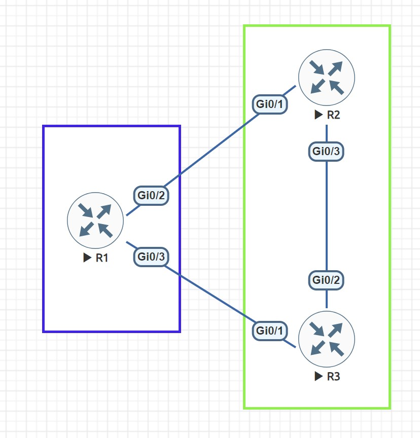
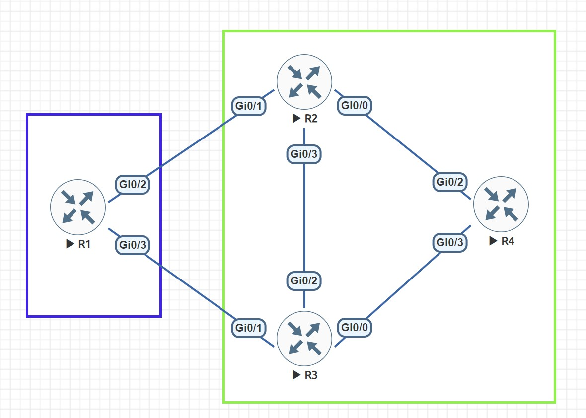
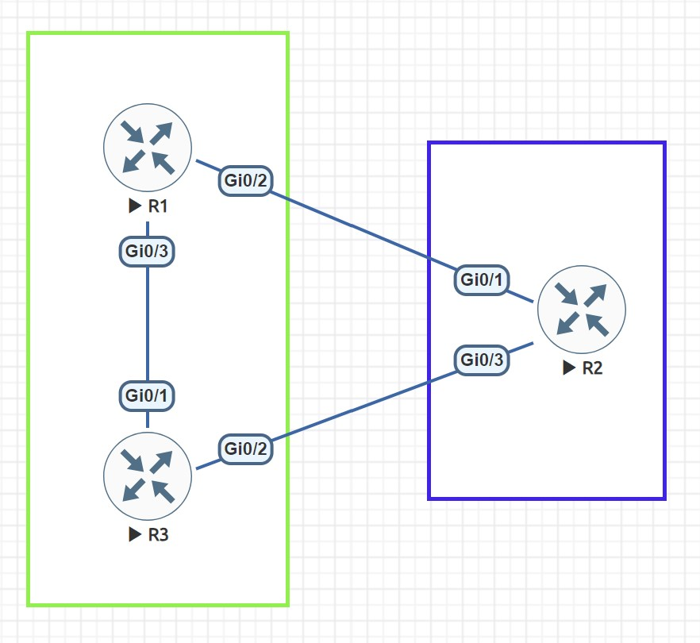
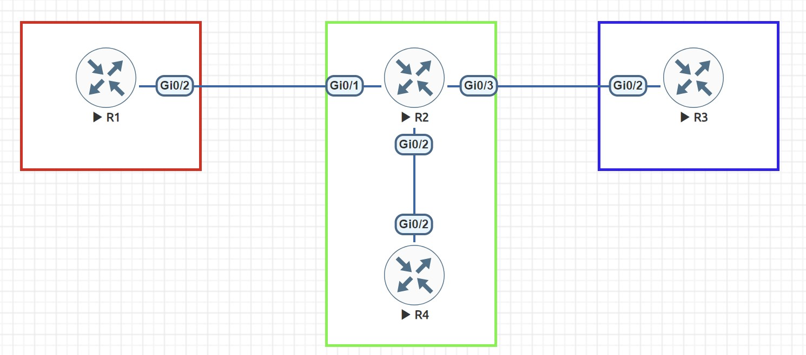

# Network Lessons CCIE Routing & Switching

## BGP
### Path Attributes
**Weight**
* Weight attribute <b>influence on a router</b>.
* Weight <b>HIGHEST</b> is chosen.
* Setting on <b>decision router's inbound interface</b>.

```bash
R1#show ip bgp
BGP table version is 2, local router ID is 192.168.13.1
Status codes: s suppressed, d damped, h history, * valid, > best, i - internal,
              r RIB-failure, S Stale, m multipath, b backup-path, f RT-Filter,
              x best-external, a additional-path, c RIB-compressed,
              t secondary path,
Origin codes: i - IGP, e - EGP, ? - incomplete
RPKI validation codes: V valid, I invalid, N Not found

     Network          Next Hop            Metric LocPrf Weight Path
 *    2.2.2.0/24       192.168.13.3             0           200 2 i
 *>                    192.168.12.2             0           300 2 i
R1#
*Oct 20 16:14:00.631: %BGP-5-ADJCHANGE: neighbor 192.168.12.2 Up
*Oct 20 16:14:00.753: %BGP-5-ADJCHANGE: neighbor 192.168.13.3 Up
```

**Local Preference**
* Local Preference <b>influence to all routers in an AS</b>.
* Local Preference <b>HIGHEST</b> is chosen.
* Setting on <b>decision router's inbound interface</b>.

```bash
R4#show ip bgp
BGP table version is 3, local router ID is 4.4.4.4
Status codes: s suppressed, d damped, h history, * valid, > best, i - internal,
              r RIB-failure, S Stale, m multipath, b backup-path, f RT-Filter,
              x best-external, a additional-path, c RIB-compressed,
              t secondary path,
Origin codes: i - IGP, e - EGP, ? - incomplete
RPKI validation codes: V valid, I invalid, N Not found

     Network          Next Hop            Metric LocPrf Weight Path
 *>i  1.1.1.0/24       3.3.3.3                  0    600      0 1 i
 * i                   2.2.2.2                  0    100      0 1 i
```

**AS Path**
* AS Path prepending <b>influence to Next Hop router</b>.
* AS Path <b>LOWEST</b> is chosen.
* Setting AS Path prepending policy on <b>decision router's outbound interface</b>.

```bash
R2#show ip bgp
BGP table version is 2, local router ID is 192.168.23.2
Status codes: s suppressed, d damped, h history, * valid, > best, i - internal,
              r RIB-failure, S Stale, m multipath, b backup-path, f RT-Filter,
              x best-external, a additional-path, c RIB-compressed,
              t secondary path,
Origin codes: i - IGP, e - EGP, ? - incomplete
RPKI validation codes: V valid, I invalid, N Not found

     Network          Next Hop            Metric LocPrf Weight Path
 *    1.1.1.0/24       192.168.12.1             0             0 1 1 1 1 1 1 i
 *>                    192.168.23.3             0             0 1 i
```

**Multi Exit Discriminator (MED)**
* MED <b>influence to all routers in remote AS, not forward to other AS</b>.
* MED <b>LOWEST</b> is chosen.
* Setting MED policy on <b>decision router's outbound interface</b>.

```bash
R2#show ip bgp
BGP table version is 2, local router ID is 192.168.23.2
Status codes: s suppressed, d damped, h history, * valid, > best, i - internal,
              r RIB-failure, S Stale, m multipath, b backup-path, f RT-Filter,
              x best-external, a additional-path, c RIB-compressed,
              t secondary path,
Origin codes: i - IGP, e - EGP, ? - incomplete
RPKI validation codes: V valid, I invalid, N Not found

     Network          Next Hop            Metric LocPrf Weight Path
 *    1.1.1.0/24       192.168.12.1           700             0 1 i
 *>                    192.168.23.3           500             0 1 i
```


### BGP Community
Take a close look at the second command, we have to use the neighbor send-community
command because the router doesn't automatically send BGP communities to its neighbors

**Internet**
* When we want to advertise all prefixes to BGP neighbors.

**No-Advertise**
* When we don't want a BGP neighbor advertise any prefix to others.

```bash
R2#show ip bgp
 *>   1.1.1.1/32       192.168.12.1             0             0 1 i

R2#show ip bgp 1.1.1.1
BGP routing table entry for 1.1.1.1/32, version 2
Paths: (1 available, best #1, table default)
  Advertised to update-groups:
     7          8
  Refresh Epoch 1
  1
    192.168.12.1 from 192.168.12.1 (1.1.1.1)
      Origin IGP, metric 0, localpref 100, valid, external, best
      rx pathid: 0, tx pathid: 0x0

R2#show ip bgp 1.1.1.1
BGP routing table entry for 1.1.1.1/32, version 2
Paths: (1 available, best #1, table default, not advertised to any peer)
  Not advertised to any peer
  Refresh Epoch 1
  1
    192.168.12.1 from 192.168.12.1 (1.1.1.1)
      Origin IGP, metric 0, localpref 100, valid, external, best
      Community: no-advertise
      rx pathid: 0, tx pathid: 0x0

R2#show ip bgp neighbors 192.168.23.3 advertised-routes
Total number of prefixes 0

R2#show ip bgp neighbors 192.168.24.4 advertised-routes
Total number of prefixes 0
```